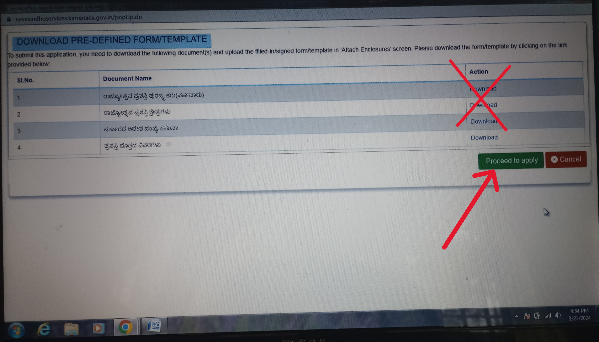
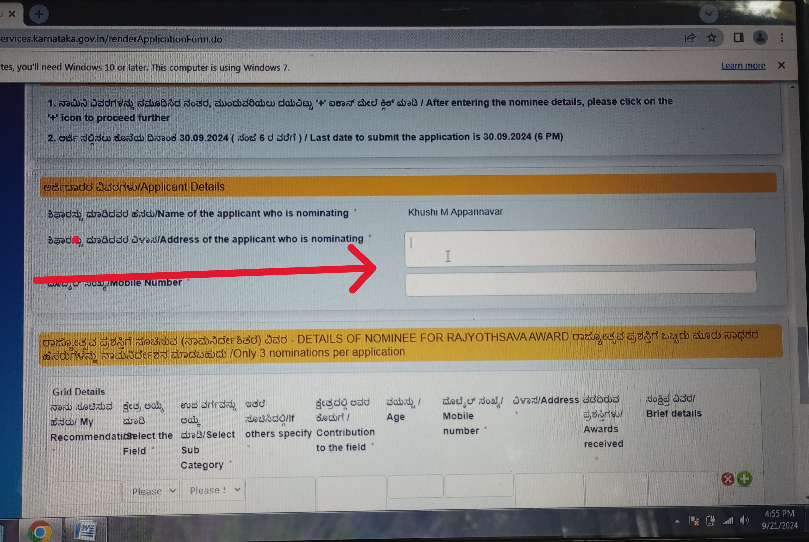
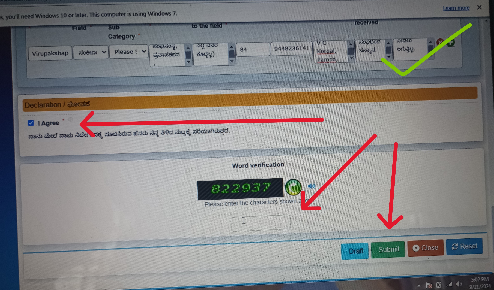
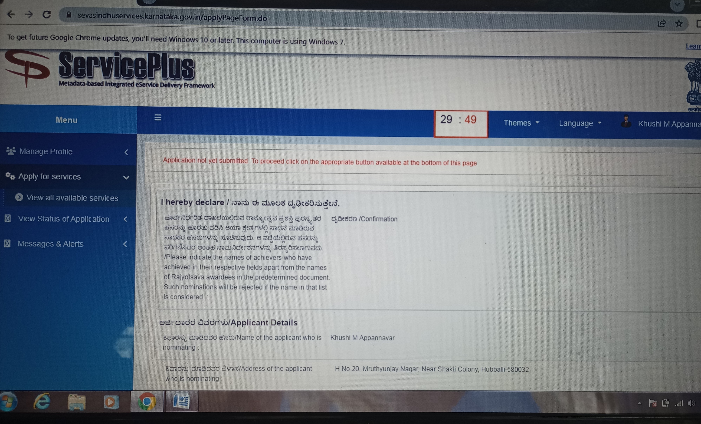
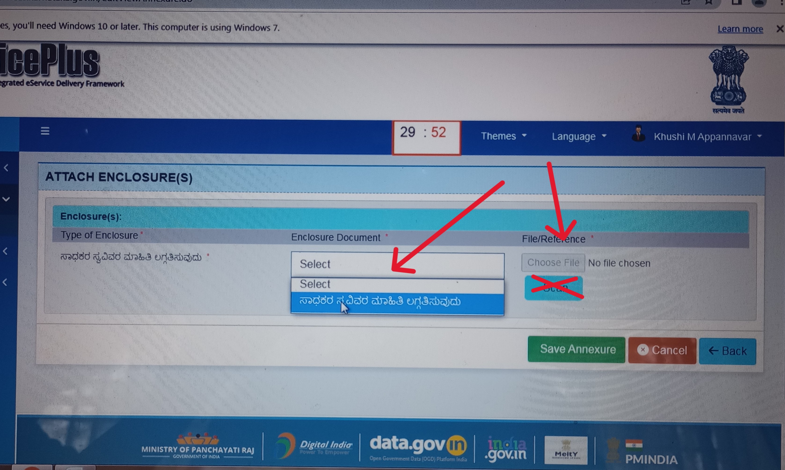
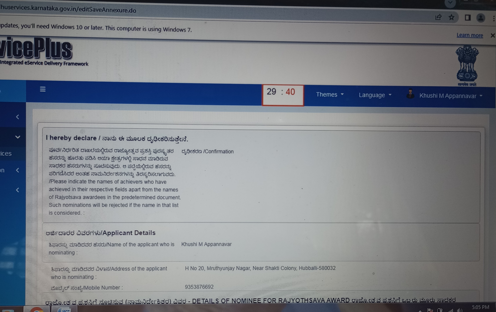
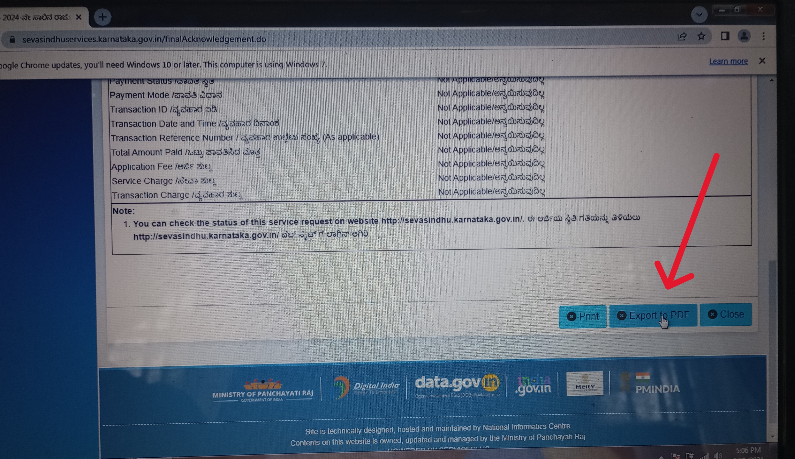
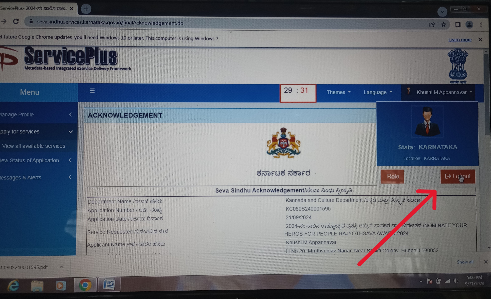

## Support the Nomination of Mr. Korgal Virupakshappa (My Grand Father) for the Rajyotsava Award 2024

My dear friends, I kindly ask for your support in nominating my grandfather, Mr. Korgal Virupakshappa, for this year’s Rajyotsava Award. 

Your vote and encouragement would mean a lot in recognizing his outstanding contributions.


## Registering yourself to SevaSindhu


1. Open Login/register portal
    Seva Sindhu portal link:
    [https://sevasindhuservices.karnataka.gov.in/login.do#](https://sevasindhuservices.karnataka.gov.in/login.do#)

2. Click on **New User? Register here** 
    
    (If you already have an account, It'll say, account exists and will ask you to login. In case you don't remember the password, you can select **Forgot Password** and reset with the registered mobile number)

   

### Verify your Aadhaar Card

3. Enter **Aadhar Card number** and captcha and 

    click next

   

4. Enter the **OTP** you recieve at your **Registered Mobile number in Aadhar Card**
    
    Click Continue

   


4. The below given window will pop up. 
    Make sure ONLY **Aadhaar Card** under **Issued Documents** section is checked
    UNCHECK the other two boxes

    DO NOT CHANGE ANYTHING ELSE

    Click Allow

   


### Start your Regsitration to Seva Sindhu Portal

5. Enter your Mobile number, email ID **(You'll have to very these)** and desired password for the Seva Sindhu Portal. 

    (Please remember this as you might need this in future)

   


6. Enter the OTP recieved in email and mobile number respectively. Please be patient and maybe listen to some music as it might get delayed to recieve the OTP.

    After entering, click **Validate**

   


> 🥳🥳 Congratulations You have registered yourself to Seva Sindhu Portal


## Nomination procedure

1.  Open Login/register portal
    Seva Sindhu portal link:
    [https://sevasindhuservices.karnataka.gov.in/login.do#](https://sevasindhuservices.karnataka.gov.in/login.do#)

    Now, login!!

2. The below given window opens

    You'll be able to see you name in top right corner

    in left section
    Under **Apply for services** click **View all available services**


    |  |  |
    |--------------------------|--------------------------|


3. The below windlow shows. In search bar, type "Rajy" only option is left, click that

    |  |  |
    |--------------------------|--------------------------|

4. Below given window. DO NOT DOWNLOAD ANYTHING. Maximise the window, and just click **Proceed to apply**

    


4. Below given window opens. Scroll down and start filling the information. 

Check the box for consnet and scroll down

    |  |  |
    |--------------------------|--------------------------|

5. In **applicant details** section

    Please fill the **address in your aadhar card** and the **mobile number you gave for Seva Sindhu**

    

### Filling details of Nominee
6. in Grid details
    - My Recommendation: [copy/paste]
        ``` bash
        Virupakshappa Korgal
        ```
    - Select the field: ಸಂಕೀರ್ಣ
        **(At the end of drop field)**

        

    - Select Sub Category -
        **LEAVE BLANK**

    - Others specify if required: [copy/paste]
        ``` bash
        ಸಾಹಿತ್ಯ, ಶಿಕ್ಷಣ, ಸಮಾಜಸೇವೆ, ನಾಟಕರಚನೆ, ಸಂಶೋಧನೆ, ಪುರಾಣರಚನೆ, ರೇಡಿಯೋಪ್ರಸಾರ, ಅಂಕಣಬರಹ, ಸಾಹಿತ್ಯಸಂಪಾದನೆ, ಸಾಹಿತ್ಯಗೋಷ್ಠಿ, ಸಂಘಸಂಸ್ಥೆ, ಪ್ರವಾಸಕಥನ
        ```

    - Contribution to the field: [copy/paste]

        ```
        ಸಾಹಿತ್ಯರಚನೆ:
        1. ನ್ಯಾಯ ಮತ್ತು ಇತರ ಕತೆಗಳು : ಕಥಾಸಂಕಲನ -೧೯೮೮
        2. ಬದುಕಿನ ಚಿತ್ರಗಳು   :ಕಥಾಸಂಕಲನ-೧೯೮೯
        3. ಮಣ್ಣಿನಗುಣ: ಕಥಾಸಂಕಲನ ೧೯೯೨ ಮಣ್ಣಿನಗುಣ ಕಥೆ ೧೯೯೫ದಲ್ಲಿ ಪ್ರಥಮ (ಐಚ್ಛಿಕ ಕನ್ನಡಪಿ.ಯು.ಸಿಗೆ ಪಠ್ಯವಾಗಿತ್ತು. 4.ಪ್ರೀತಿಯಾಗಿ ಕಾಡಿತ್ತು ನೋಡ :(ಒಂದು ನಾಯಿಯ ಸತ್ಯಕಥೆ) -೨೦೦೧.
        5. ಸಿಂಬಳ ಬುರುಕನ ಕಥೆಗಳು :ಮಕ್ಕಳಕಥೆಗಳು -೧೯೯೯
        6. ನೆಲವಿಗಿರಿಗೆಪ್ಪನವರು :ಚರಿತ್ರೆ (೧೯೯೧ ತೋಂಟದಾರ್ಯಮಠಪ್ರಕಟಣೆ). 
        7. ಕುರುಬಗೊಂಡಶೆಟ್ಟರು :ಚರಿತ್ರೆ (೧೯೯೬ ತೋಂಟದಾರ್ಯಮಠ ಪ್ರಕಟಣೆ)
        8. ಮುದೇನೂರು ಸಂಗಣ್ಣನವರು :ಚರಿತ್ರೆ (೨೦೧೯ ತೋಂಟದಾರ್ಯಮಠಪ್ರಕಟಣೆ). 9.ಚಕ್ಕಡಿಗೊಂದು ಮೋಟಾರು  :ಮಕ್ಕಳಕಾವ್ಯ (೨೦೦೨) ಜ್ಞಾನವಿಜ್ಞಾನ ಪರಿಷತ್ತು ಪ್ರಕಟಣೆ. 
        10. ಗುಜುಮಾಪುರಿ :ಮಕ್ಕಳ ಕವಿತೆಗಳು (೨೦೧೦) 
        11. ಮೀಸೆಯ ಜೋಕಾಲಿ :ಮಕ್ಕಳ ಕವಿತೆಗಳು (೨೦೧೦) 
        12. ಲಲಿತ ಲಹರಿ :ಪ್ರಬಂಧ ಸಂಕಲನ (೨೦೦೨) 
        13. ಶಬ್ದಸೋಪಾನ :ವಿಮರ್ಶೆ (೨೦೦೩) ಆ ವರ್ಷದ ಕನ್ನಡ ಮತ್ತು ಸಂಸ್ಕೃತ ಇಲಾಖೆಯ ಪುಸ್ತಕ ಬಹುಮಾನ ಪಡೆದ ಕೃತಿ. 
        14. ಶಿವಲಿಂಗಕಾವ್ಯ :ಭಾಮಿನಿಷಟ್ಪದಿಯಲ್ಲಿ ಪುರಾಣ (೨೦೦೪)
        15. ವಚನಾಂಜಲಿ :ವಚನಗಳ ಸಂಕಲನ ( ೨೦೦೭)
        16. ಶ್ರೀಹಮ್ಮಿಗೇಶ್ವರ ಚರಿತ್ರೆ :ಭಾಮಿನಿ ಷಟ್ಪದಿಯಲ್ಲಿ ಕಾವ್ಯ (೨೦೧೦) 
        17. ಕಾವೇರಿಯಿಂದ ಗೋದಾವರಿ :ಪ್ರವಾಸ ಕಥನ (೨೦೨೧) 
        18. ಗಣಿತ ವಿಳಾಸ ರಾಜಾದಿತ್ಯ : ಸಂಶೋಧನೆ- ೨೦೨೦ 
        19. ತನಿಜೇನಸುಧೇ :ಅಂಕಣ ಬರಹಗಳು (೨೦೨೧)  
        20. ಶಿವಲಿಂಗ ಪುರಾಣ :ಭಾಮಿನಿಷಟ್ಪದಿಯಲ್ಲಿ ಧಾರ್ಮಿಕಕಾವ್ಯ (೨೦೨೨)  
        21. ಹಮ್ಮಿಗೇಶ್ವರಪುರಾಣ: ಭಾಮಿನಿಷಟ್ಪದಿಯಲ್ಲಿ ಧಾರ್ಮಿಕಕಾವ್ಯ (೨೦೨೨) 
        22. ಕ್ಷೇತ್ರಗಣಿತ :ಹಳಗನ್ನಡ ಸಂಶೋಧನೆ (೨೦೨೨)
        23. ಮುತ್ತಿನ ಚಿಪ್ಪಿನ ಸೂತ್ರಗಳು ಸಂಶೋಧನೆ (೨೦೨೩) 
        24. ನುಡಿಯಎಡವಿತ್ತು ಕಲ್ಯಾಣ :ನಾಟಕ:(೨೦೨೩) 
        25. ಕಲ್ಯಾಣದಉಳಿವು - ಕಾದಂಬರಿ  (೨೦೨೪)
        
        ರೇಡಿಯೋಪ್ರಸಾರ :  ಒಟ್ಟುಏಳುರೇಡಿಯೋಕಾರ್ಯಕ್ರಮಗಳು (ಜಗದಅಭಾವದಕಾರಣಇಲ್ಲಿಎಲ್ಲವಿವರಕೊಟ್ಟಿಲ್ಲ.
        
        ಸಾಹಿತ್ಯಗೋಷ್ಠಿಗಳು : ೧೩ ಗೋಷ್ಠಿಗಳಲ್ಲಿ ಬಾಗವಹಿಸಿದ್ದಾರೆ 1.ಕೃಷ್ಣಮೂರ್ತಿ ಪುರಾಣಿ ಕಶತಮನೋತ್ಸವ ಹಾವೇರಿ ಜಿಲ್ಲೆ ಸಂಯೋಜಕ (ಜಗದ ಅಭಾವದ ಕಾರಣ ಇಲ್ಲಿ ಎಲ್ಲ ವಿವರ ಕೊಟ್ಟಿಲ್ಲ.)

        ಸಂಘ ಸಂಸ್ಥೆಗಳಲ್ಲಿ ಸೇವೆ:
        1. ೧೯೯೪-೨೦೦೪ ಜಿಲ್ಲಾಸಾಕ್ಷರ ಸಮಿತಿ ಸದಸ್ಯ, 
        2. ೧೯೭೧-೧೯೭೪ ಹಾವೇರಿ ಗೆಳೆಯರ ಬಳಗದ ಅಧ್ಯಕ್ಷ, 
        3. ೧೯೭೮-೧೯೮೩ : ಹಾವೇರಿ ಜ್ಞಾನ ಗಂಗಾ ಶಿಕ್ಷಣ ಸಮಿತಿಯ ಕಾರ್ಯಾಧ್ಯಕ್ಷ. 
        4. ೨೦೧೦-೨೦೧೨ ಕೃಷ್ಣಮೂರ್ತಿ ಪರಾಣಿಕ ರಾಷ್ಟ್ರೀಯ ಸ್ಮಾರಕ ಟ್ರಸ್ಟ ಬೆಳಗಾವಿಯ ಟ್ರಸ್ಟ ಸದಸ್ಯ. 
        
        ಸಂಪಾದನೆಗಳು: ಒಟ್ಟುಏಳು.(ಜಗದ ಅಭಾವದ ಕಾರಣ ಇಲ್ಲಿ ಎಲ್ಲ ವಿವರ ಕೊಟ್ಟಿಲ್ಲ)
        
        ಅಂಕಣಗಳ ಪ್ರಕಟಣೆ: ಒಟ್ಟು ೬ ಅಂಕಣಗಳನ್ನು ವಿವಿಧ ಕಡೆ ಪ್ರಕಟಣೆ. (ಜಗದ ಅಭಾವದ ಕಾರಣ ಇಲ್ಲಿ ಎಲ್ಲ ವಿವರ ಕೊಟ್ಟಿಲ್ಲ)
        ```

    - Age: 84

    - Mobile number: 9448236141

    - Address: [copy/paste]
        ```
        V C Korgal, Pampa, III Main, II Cross, A Block, Vidyanagar, Haveri-581110
        ```

    - Awards recieved: [copy/paste]
        ```
        ಸನ್ಮಾನ ಮತ್ತು ಸತ್ಕಾರ:
        1. ೧೯೮೦ರ ವರ್ಷದ ವ್ಯಕ್ತಿಯೆಂದು ಹಾವೇರಿ ರೋಟರಿ ಕ್ಲಬನಿಂದ ಸನ್ಮಾನ. 
        2. ೧೯೯೨ : ತೋಟದಾರ್ಯ ಮಠ ಗದಗ ಅವರಿಂದ ವೀರಶೈವ ಪುಣ್ಯ ಪುರುಷಮಾಲಿಕೆಯ ಗ್ರಂಥ ರಚನೆಗಾಗಿ ಸನ್ಮಾನ. 3. ೨೦೦೪ :ಶಿವಲಿಂಗ ಕಾವ್ಯಕ್ಕೆ ಹುಕ್ಕೇರಿಮಠ ಪ್ರಶಸ್ತಿ
        4. ೨೦08 ಮಾದನಹಿಪ್ಪರಗಿಯ ಶಿವಲಿಂಗೇಶ್ವರ ಮಠದಲ್ಲಿ ಸನ್ಮಾನ 
        5. ೨೦೧೧ :ವಿದ್ಯಾವರ್ಧಕ ಸಂಘ ಧಾರವಾಡ ಅವರ ೧೨೨ನೇ ವರ್ಷಾಚರಣೆಯಲ್ಲಿ ಸನ್ಮಾನ. 
        6. ೨೦೧೧: ೬ನೇ ಹಾವೇರಿ ಜಿಲ್ಲಾ ಸಾಹಿತ್ಯ ಸಮ್ಮೇಳನದ ಸರ್ವಾಧ್ಯಕ್ಷ 7. ೨೦೧೨ ಬೆಂಗಳೂರಿನಲ್ಲಿ ಜರುಗಿದ ೭೭ನೇ ಅಖಿಲ ಭಾರತ ಸಾಹಿತ್ಯ ಸಮ್ಮೇಳನದಲ್ಲಿ ಸನ್ಮಾನ 
        8. ಜೈನ ಸಾಹಿತ್ಯ ಕೊಡುಗೆಗಾಗಿ ಹಾವೇರಿ ಸಂಭವನಂದಿಮುನಿಗಳಿಂದ ಸನ್ಮಾನ.
        9. ಶ್ರೀ ಶಿವಬಲಿಂಗ ಕಾವ್ಯ ರಚನೆಗಾಗಿ ಶಿರಿಯಾಳ ಕೊಪ್ಪ ಸಾಹಿತ್ಯ ಸಂಘದಿಂದ ಸನ್ಮಾನ
        ```
    - Brief details: [copy/paste]
        ```
        ಶ್ರೀಯುತ ಕೋರಗಲ್ ವಿರುಪಾಕ್ಷಪ್ಪನವರು ೮೪ ವಯಸ್ಸಿನ ನಿವೃತ್ತ ಗಣಿತ ಪ್ರಾದ್ಯಾಪಕರು. ಬೆಳಕಿಗೆ ಬಾರದ ಬಹುಮುಖ ಪ್ರತಿಭೆ. ಎಂದು ಪ್ರಶಸ್ತಿಯನ್ನು ಬೆನ್ನುಹತ್ತಿ ಹೋದವರಲ್ಲ. ಕೊಪ್ಪಳ ಜಿಲ್ಲೆಯ ಸಣ್ಣ ಹಳ್ಳಿಯ ಬಡತನದ ಕುಟುಂಬದಲ್ಲಿ ಹುಟ್ಟಿದ ಇವರು, ತಮ್ಮ ಊರಿನಲ್ಲಿ ೧೦ನೆಯ ತರಗತಿ ಪಾಸಾದ ಪ್ರಥಮ ವ್ಯಕ್ತಿ. ಮುಂದೆ ಶಿಕ್ಷಣವನ್ನು ಮುಂದುವರೆಸಿ ಗಣಿತದಲ್ಲಿ ಮಾಸ್ಟರ್ಡಿಗ್ರಿ ಮಾಡಿ ಕೆಎಲಈ ಕಾಲೇಜಿನಲ್ಲಿ ಪ್ರಾದ್ಯಾಪಕರದಾಗಿ ೩೦ವರ್ಷ ಸೇವೆಸಲ್ಲಿಸಿ ನಿವೃತ್ತರಾದರು. ಇವರು ಕನ್ನಡದಲ್ಲಿ ಮುಂದೆ ಮಾಸ್ಟರ್ಡಿಗ್ರಿ ಮಾಡಿ ಕನ್ನಡದಲ್ಲಿ ಸಾಹಿತ್ಯ ಹಾಗೂ ಸಂಶೋಧನೆಯಲ್ಲಿ ತೊಡಗಿಸಿ ಕೊಡರು. 

        ಕೋರಗಲ್ ವಿರುಪಾಕ್ಷಪ್ಪನವರು ಲೇಖಕರಾಗಿ ಕಥಾಸಂಕಲನ, ಮಕ್ಕಳಕಥೆ, ಕಾವ್ಯ, ಪ್ರಬಂಧ ಸಂಕಲನ, ಪ್ರವಾಸ ಕಥನ, ಪುರಾಣ, ವಚನ ಸಂಕಲನ, ಗಣಿತ ಸಂಶೋಧನೆ, ನಾಟಕ, ಚರಿತ್ರೆ, ಸಾಹಿತ್ಯ ಸಂಪಾದನೆ ವಿಭಾಗಗಳಲ್ಲಿ ೨೩ ಪುಸ್ತಕಗಳನ್ನು ಪ್ರಕಟಿಸಿದ್ದಾರೆ. ಸುಧಾ, ಮಯೂರ ಹಾಗೂ ಅನೇಕ ಪತ್ರಿಕೆಗಳಲ್ಲಿ ಕಥೆ, ಅಂಕಣ ಪ್ರಕಟವಾಗಿವೆ. ಆಕಾಶವಾಣಿಯಲ್ಲಿ ಚಿಂತನ, ಕಥೆ, ಕಾವ್ಯ, ನಾಟಕಗಳು ಪ್ರಸಾರವಾಗಿವೆ. ತಾಲೂಕ, ಜಿಲ್ಲೆ ಹಾಗೂ ಅಖಿಲ ಭಾರತ ಸಾಹಿತ್ಯಸಮ್ಮೇಳನಗಳ ಕಮ್ಮಟಗಳಲ್ಲಿ ಭಾಗವಹಿಸಿದ್ದಾರೆ. ಹನ್ನೆರಡನೆಯ ಶತಮಾನದಲ್ಲಿ ಜೈನ ಕವಿ ರಾಜಾದಿತ್ಯನಿಂದ ಕನ್ನಡದಲ್ಲಿ ರಚಿತವಾದ ಗಣಿತ ಕೃತಿಗಳ ಬಗ್ಗೆ ಸಂಶೋಧನೆ ಮಾಡಿದ್ದಾರೆ. ಗಣಿತ ಶಿಕ್ಷಕರಾಗಿ, ನಾಲ್ಕು ಕಥಾಸಂಕಲನಗಣ್ನು ಪ್ರಕಟಸಿದ್ದಾರೆ. ಹಾವೇರಿ, ಧಾರವಾಡ ಜಿಲ್ಲೆಯಲ್ಲೆಲ್ಲ ಕಥಾಕಮ್ಮಟಗಳನ್ನು ಏರ್ಪಡಿಸಿ ಕಥೆಗಾರ ರಸಂಖ್ಯೆಯನ್ನು ಬೆಳಸಿದ್ದಾರೆ. ಅವರ ಸಂಪಾದನೆಯಲ್ಲಿ ಮೂರು ಜಿಲ್ಲಾ ಪ್ರಾತಿನಿಧಿಕ ಕಥಾಸಂಕಲನಗಳು ಪ್ರಕಟಗೊಂಡಿವೆ. ಇಂಗ್ಲಿಷಿನ ಭರಾಟೆಯ ಈದಿನಮಾನಗಳಲ್ಲಿ, ಹಾವೇರಿಗೊಂದು ಒಳ್ಳೆಯ ಶಾಲೆಯನ್ನು ತರಬೇಕೆಂದು ಗೆಳೆಯರ ಬಳಗದವತಿಯಿಂದ ಉತ್ಕೃಷ್ಟ ಕನ್ನಡ ಪ್ರಾಥಮಿಕ ಶಾಲೆಯನ್ನು ಸ್ಥಾಪಿಸಿ ನಡೆಯಿಸಿಕೊಂಡು ಬರುತ್ತಿದ್ದಾರೆ. ಮಾರಕರೋಗಗಳಿಗೆ ಲಸಿಕೆಗಳೆಇರದಿದ್ದ  ೧೯೭೦ರ ದಶಕದಿಂದ ಹೊರಗಿನಿಂದ ಲಸಿಕೆಯನ್ನು ತರಿಸಿ ಗೆಳೆಯರಬಳಗದಿಂದ ಪೋಲಿಯೊ ಲಸಿಕೆ, ಬಿಸಿಜಿ ಲಸಿಕೆ, ಧಮಾರ ರೋಗದ ಲಸಿಕೆಗಳನ್ನು ಪ್ರತಿ ತಿಂಗಳು ಕೊಡುವ ವ್ಯವಸ್ಥೆಯನ್ನು ಮಾಡುವ ಮೂಲಕ ವೈದ್ಯಕೀಯ ಸೇವೆಯನ್ನೂ ನೀಡಿದ್ದಾರೆ. ಕೋರಗಲ್ ವಿರುಪಾಕ್ಷಪ್ಪನವರು ಅವರು ಒಳ್ಳೆಯ ಸಂಶೋಧಕರಾದರೂ, ಪ್ರಚಾರ ಪ್ರೀಯರಲ್ಲದಿದ್ದುದಕ್ಕೆ ಬೆಳಕಿಗೆ ಬಂದಿಲ್ಲ. ಕೋರಗಲ್ ವಿರುಪಾಕ್ಷಪ್ಪನವರು ಕನ್ನಡ ಪತ್ರಿಕೆಗಳಿಗೆ ಕಥೆ ಬರೆಯುತ್ತಿದ್ದುರಿಂದ, ಕಥೆಗಾರರೆಂದು ಗುರುತಿಸಿಕೊಂಡು ಪ್ರಸಿದ್ಧರಾಗಿದ್ದಾರೆ. ಇವರು ಒಟ್ಟು ೨೫ ಪುಸ್ತಕಗಳನ್ನು ವಿವಿಧ ವಿಷಯಗಳಲ್ಲಿ ಪ್ರಕಟಿಸಿದ್ದಾರೆ. ಒಟ್ಟು ಏಳು ರೇಡಿಯೋ ಕಾರ್ಯಕ್ರಮಗಳಲ್ಲಿ ತಮ್ಮ ಕೊಡುಗೆಯನ್ನು ನೀಡಿದ್ದಾರೆ. ಜಗದ ಅಭಾವದ ಕಾರಣ ಎಲ್ಲ ವಿವರ ಇಲ್ಲಿ ನೀಡಲು ಆಗುತ್ತಿಲ್ಲ.
        ```

7. Check **I Agree**, enter captcha and click **Submit** at the bottom of the page

   

8. Below given window pops up.

   Scroll down and click **Attach annexure**

   |  |  |
   |--------------------------|--------------------------|

10. Selct as given in the below picture

    Download this pdf: [02_Biodata_V C Korgal.pdf](https://drive.google.com/uc?export=download&id=1QD6Xr2iZ6mfzbGslyacXUbqwt8lkf3HR)

    Now click **choose file** and attach that 02_Biodata_V C Korgal.pdf

    Click **save annexure**

    |  |  |  |
    |--------------------------|--------------------------|------------|

11. You go back to the declaration page, scroll down and press submit

    |  |  |
    |--------------------------|--------------------------|

12. You get the acknowledgement page
    (Thank you soooooo much)

    

13. You can export a copy.

    Don't forget to log out!
    |  |  |
    |--------------------------|--------------------------|

# Thankyou soo much for for the support


